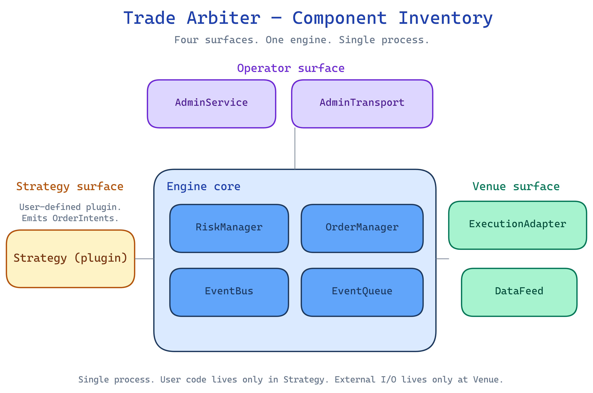

# Trade Arbiter — Architecture

> One-page system map. Update when a component is added, removed, renamed, or its boundary changes.

## Component inventory

Source: [`diagrams/component-inventory.excalidraw`](diagrams/component-inventory.excalidraw). Rendered via the excalidraw skill's playwright pipeline — edit the `.excalidraw` and re-run the renderer to regenerate the PNG.

<!--
Bulleted list of every internal component with a one-line role.
Each entry should link to its contract in `contracts/<name>.md`.

Example seed list (from Plan 1 contracts):
- **Engine** — orchestrates the event loop, owns the EventQueue and dispatches to subscribers
- **EventQueue** — single-producer, single-consumer ordered queue of EngineEvents
- **EventBus** — pub/sub wrapper over the queue for read-only subscribers
- **OrderManager** — assigns requestIds, tracks lineage, owns the open-orders table
- **RiskManager** — composes RiskRules in fixed order, persists RiskDecisions, updates RiskState
- **ExecutionAdapter** — venue-side: submits orders, emits OrderEvents and FillEvents
- **DataFeed** — venue-side: subscribes to market data, emits MarketEvents
- **Strategy** — user-defined: consumes events, emits OrderIntents
- **AdminService** — in-process control surface (pause/resume/kill, list runs, etc.)
- **AdminTransport** — pluggable framing layer (Unix socket in v1)
-->

## Data flow

<!--
ASCII or mermaid diagram showing how an OrderIntent travels:

  Strategy -> RiskManager -> OrderManager -> ExecutionAdapter -> Venue
                                                    |
                                                    v
                                              FillEvent / OrderEvent
                                                    |
                                                    v
                                                EventBus -> Strategy / Portfolio
-->

## Process model

<!--
Where the engine runs (single process, threads, workers).
How the admin transport sits beside it.
Where the dashboard server connects.
What's in-process vs out-of-process.
-->

## Persistence

<!--
SQLite schemas, Parquet files, log files. Where state lives, what's durable, what's ephemeral.
Pointer to the plan that owns each persistence layer.
-->

## Cross-cutting concerns

<!--
One paragraph each:
- Logging (structured? sink? sampling?)
- Clock injection (deterministic for backtest, real for live)
- Deterministic ordering (how the bus enforces it)
- Kill-switch propagation (how a kill signal reaches every component)
- Config hashing (sha256 of resolved config, where it's stored)
-->

## See also

- [overview.md](overview.md)
- [contracts/](contracts/) — interface boundaries between the components above
- [decisions/](decisions/) — architectural decisions and their rationales
- [`superpowers/specs/2026-04-12-trade-arbiter-design.md`](superpowers/specs/2026-04-12-trade-arbiter-design.md) — foundational design spec
